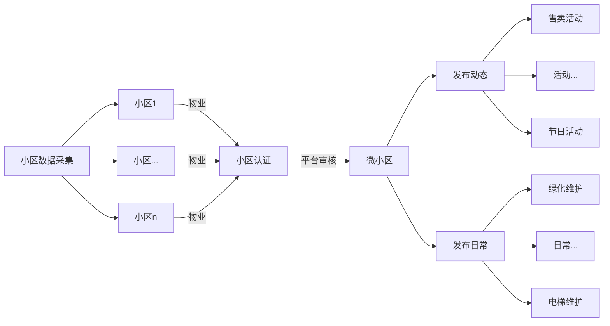
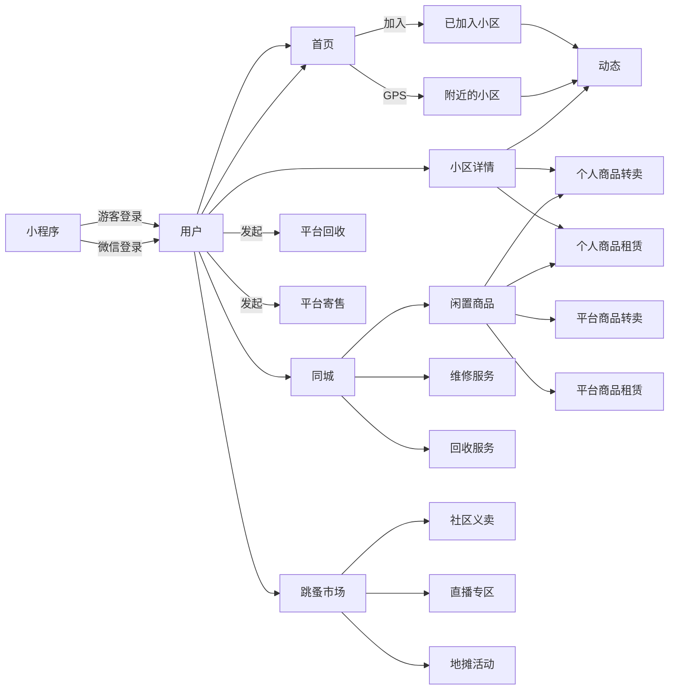
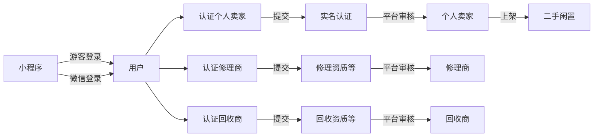

# 业务链路流程

## 小区入驻流程

```mermaid
flowchart LR
    小区数据采集 --> 小区1 --物业--> 小区认证
    小区数据采集 --> 小区... --物业--> 小区认证
    小区数据采集 --> 小区n --物业--> 小区认证
    小区认证 --平台审核--> 微小区
    微小区 --> 发布动态
    发布动态 --> 售卖活动
    发布动态 --> 活动...
    发布动态 --> 节日活动
    微小区 --> 发布日常
    发布日常 --> 绿化维护
    发布日常 --> 日常...
    发布日常 --> 电梯维护
```

## 用户交易流程

```mermaid
flowchart LR
    小程序 --游客登录--> 用户
    小程序 --微信登录--> 用户
    用户 --> 首页 --加入--> 已加入小区 --> 动态
    用户 --> 首页 --GPS--> 附近的小区 --> 动态
    用户 --> 小区详情
    小区详情 --> 动态
    小区详情 --> 个人商品转卖
    小区详情 --> 个人商品租赁
    用户 --> 同城
    同城 --> 闲置商品
    闲置商品 --> 个人商品转卖
    闲置商品 --> 个人商品租赁
    闲置商品 --> 平台商品转卖
    闲置商品 --> 平台商品租赁
    同城 --> 维修服务
    同城 --> 回收服务
    用户 --发起--> 平台回收
    用户 --发起--> 平台寄售
    用户 --> 跳蚤市场
    跳蚤市场 --> 社区义卖
    跳蚤市场 --> 直播专区
    跳蚤市场 --> 地摊活动
```

## 个人卖家运营流程

```mermaid
flowchart LR
小程序 --游客登录--> 用户
小程序 --微信登录--> 用户
用户 --> 认证个人卖家 --提交--> 实名认证 --平台审核--> 个人卖家 --上架--> 二手闲置
用户 --> 认证修理商 --提交--> 修理资质等 --平台审核--> 修理商
用户 --> 认证回收商 --提交--> 回收资质等 --平台审核--> 回收商
```

## 平台运营流程

```mermaid
flowchart LR

```
